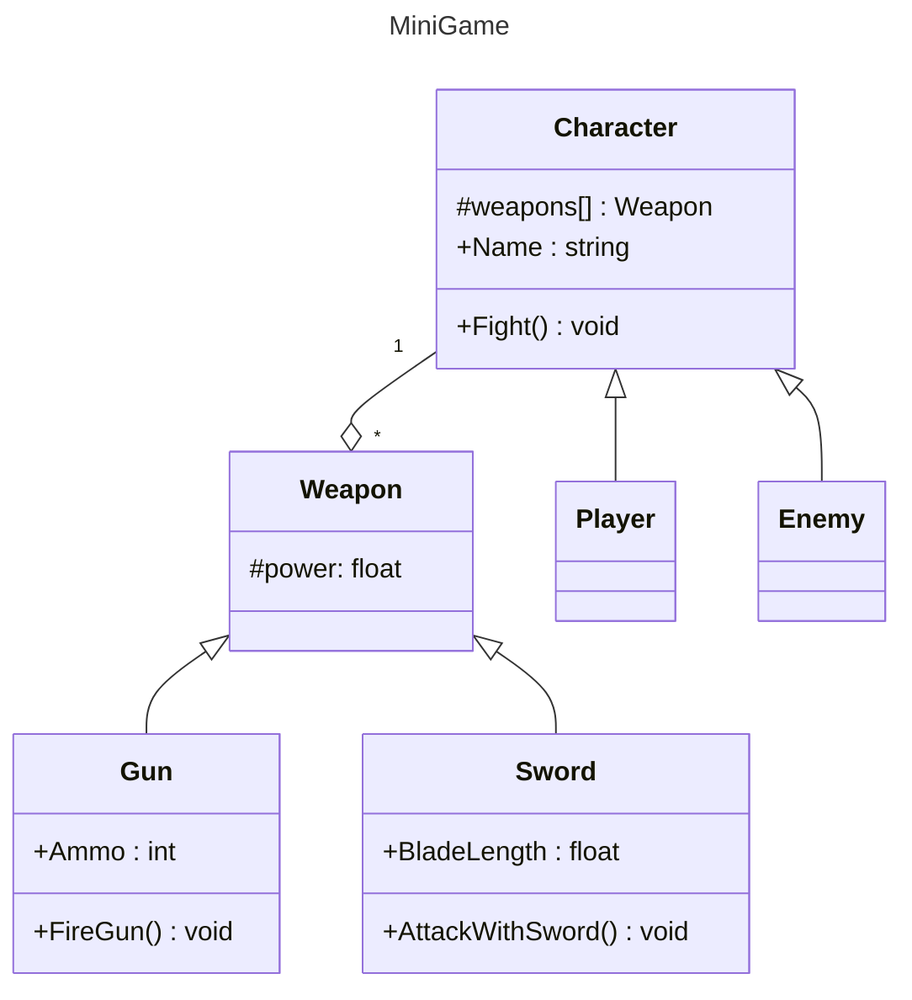

```mermaid*
---
title: MiniGame
---
classDiagram
    Character "1" --o "*" Weapon
    Weapon <|-- Gun
    Weapon <|-- Sword
    Character <|-- Player
    Character <|-- Enemy
    class Weapon{
        #power: float
    }
    class Gun{
        +Ammo : int
        +FireGun() void
    }
    class Sword{
        +BladeLength : float
        +AttackWithSword() void
    }
    class Character{
        #weapons[] : Weapon
        +Name : string
        +Fight() void
    }
    class Player{
    }
    class Enemy{
    }
```